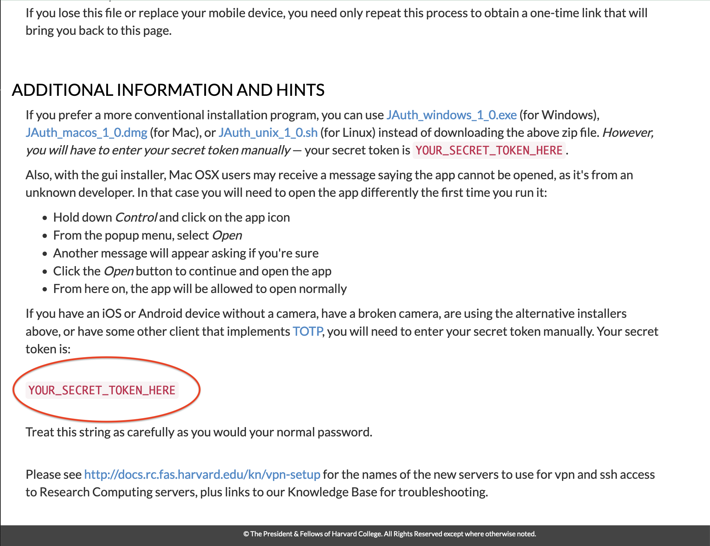

How to obtain your FASRC secret 2FA token:

1. Visit [https://two-factor.rc.fas.harvard.edu/](https://two-factor.rc.fas.harvard.edu/)
2. Log in with your FASRC Username and Password
3. Click the one-time link sent to your harvard email account to continue (this should look like: 
`https://two-factor.rc.fas.harvard.edu/oa/?otec=xxxx-xxx-xxx-xxx...`)
4. You will be take to a page with the title: **Openauth: 2-Factor Authentication**
5. Scroll down to the bottom of the page to the **Additional Information and Hints** Header
6. Your secret token should be in red text near the bottom of the page. See the embedded image below for more directions
7. Copy this value and provide it when prompted by the setup script. (if you wrote it down somewhere **destroy it afterwards/delete the file**)

**WARNING:**

**THIS FASRC TOKEN IS A SECRET PASSWORD. IF SOMEONE OBTAINS THIS THEY MIGHT BE ABLE TO HACK YOUR ACCOUNT.**

**DO NOT SAVE IT ON YOUR COMPUTER, SHARE IT WITH ANYONE, EMAIL IT TO YOURSELF, etc., etc.**

